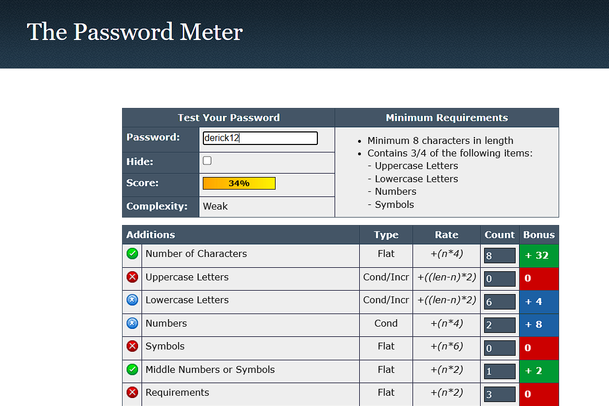
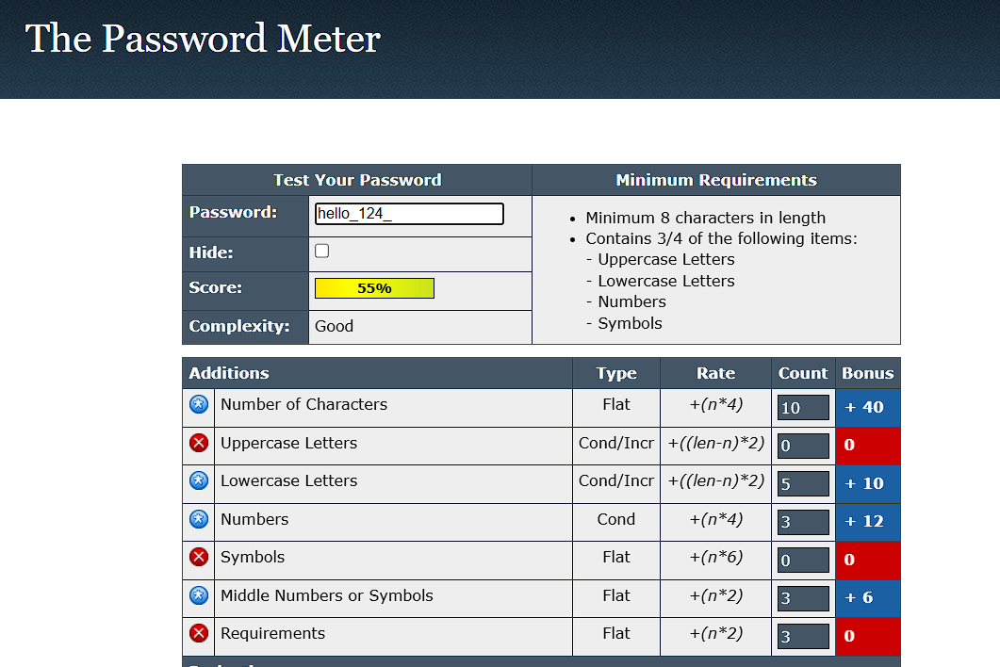
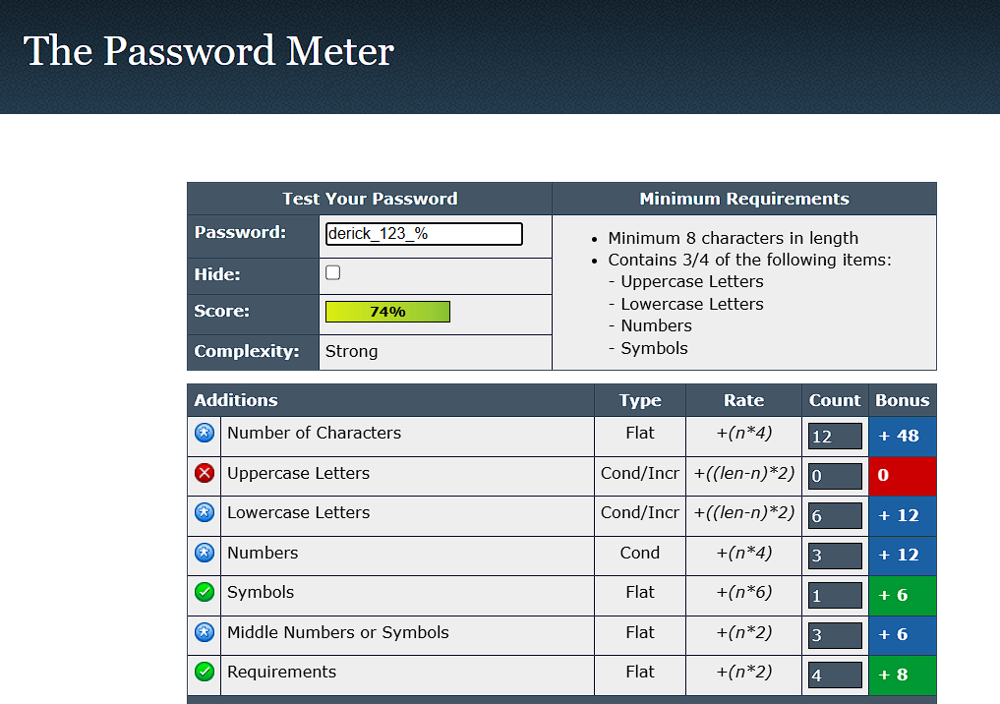

# password-analysis-report

# Task 6: Password Strength and Security Evaluation

### Objective
The objective of this task is to understand the principles of creating a strong password, test password strength using online tools, and report on the findings and best practices for password security.

---

## Part 1: Password Strength Evaluation

I created three passwords of varying complexity and tested their strength using an online password checker.

### Password 1: Weak Password

* **Password Tested:** `derick12`
* **Result Screenshot:**
    
* **Analysis:**
    This password received a very low score. The tool's feedback indicated that it's extremely common, based on a dictionary word, and follows a predictable number pattern. This makes it highly vulnerable to both dictionary and brute-force attacks.

### Password 2: Good Password

* **Password Tested:** `hello_124_`
* **Result Screenshot:**
    
* **Analysis:**
    This password scored much higher. The strength comes from its use of mixed case letters, a symbol, and a number substituting a letter ("leetspeak"). However, it is still based on a common word, which makes it less secure than a truly random password.

### Password 3: Strong Password (Passphrase)

* **Password Tested:** 'derick_123_%`
* **Result Screenshot:**
    
* **Analysis:**
    This passphrase received a perfect score. Its primary strength is its length, which makes it extremely resistant to brute-force attacks. Even though it uses simple words, the combination of four random words plus a number and symbol creates a password that is both easy to remember and computationally difficult to crack.

---

## Part 2: Research on Common Password Attacks

### What is a Brute-Force Attack?
A brute-force attack is a trial-and-error method used to decode encrypted data such as passwords. Attackers use automated software to try all possible combinations of letters, numbers, and symbols until the correct one is found. The main defense against this attack is password length and complexity.

### What is a Dictionary Attack?
A dictionary attack is a more targeted form of a brute-force attack. Instead of trying random combinations, the attacker uses a large list (a "dictionary") of common words, phrases, and previously leaked passwords. This is why using common words, even with simple modifications, is insecure.

---

## Part 3: Summary and Best Practices

### How Password Complexity Affects Security
Password complexity directly impacts security by increasing the amount of time and computational resources required for an attacker to guess it. A long, random password with a mix of character types creates an astronomically large number of possibilities, making brute-force attacks practically impossible with current technology.

### Best Practices Learned
* **Length is Critical:** Aim for at least 16 characters or more.
* **Use Complexity:** Combine uppercase letters, lowercase letters, numbers, and symbols.
* **Create Passphrases:** Use a sequence of random words to create a long, memorable, and strong password.
* **Avoid Common Mistakes:** Do not use personal information, common words, or sequential numbers (e.g., "1234").
* **Use a Password Manager:** Password managers can generate and store highly complex, unique passwords for every account.
* **Enable Multi-Factor Authentication (MFA):** MFA adds a crucial second layer of security, requiring a second form of verification (like a code from your phone) in addition to your password.
